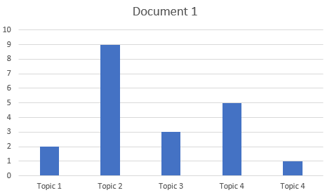
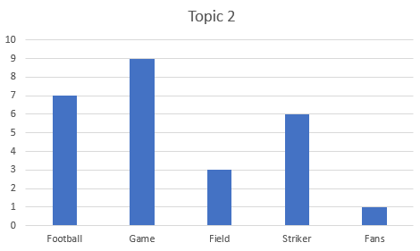

# What is Latent
Johann Peter Gustav Lejeune Dirichlet was a German mathmatician during the 18th centuary and who has some notable contributions in the modern mathematics. The Latent Dirichlet Allocation has been named after him. 

This is an algorithm for finding the probablity. In 2003, for the first time this LDA was published in a Machine Learning Journal in a graphical illustration. 

### LDA or Latent Dirichlet Allocation

In order to know LDA, we need to assume certain things
- In any text corpus, there are many documents, if some documents in it, share same topics, then it is obvious that the collection of words in those documents will also be same.
- We can get the Latent Topics upon analyzing those words which are coming frequently a given document from the text corpus

For Example: If some document is talking about Football, then it is obvious that, there will be certain words which may come frequently such as player, mid-fielder, striker, referry and etc. 

So, if we've assumed the above, then it will be easier for us to assume the following

- Documents are basically probablity distributions over Latent Topics
- Topics are also probablity distributions over words

The Below picture shows a document, where Topic#2 is with higher probability as compare to other topics in the document. So in every document there are hidden topics and some are with higher probability and some have lower probability. It is also a fact that we can't say with confidence that the actual Topic of the document is Topic#2, so what we are basically doing is that we are just getting the probablity of different hiddent topics in the document. 

And following the same methodology, we will also the probablity of the words within the Topics w.r.t. all available words in the documents. By seeing the below image, it will not be difficult job to understand that the probablity of words such as "Game" and "Football" etc are more in Topic 1.

So at this point, we as a user, try to determine that the collection of words in a particular topic are pointing towards. may be this is Football or may be it is Sports.

So, if we gather all the documents and all the topics this way using the LDA technique, we will be able to ask the machine to bring me the TOP 10 topics in any particular document. 
Or bring me the TOP 10 words in any particular topic.

Remember, that LDA will not name the Topic for you, it will only tell you that "Topic 2" following words in high probablity, and now as a user we will have to decide an appropriate topic name for it. 

So, now we can say in confidence that, what LDA does is to
- Represent the documents as a mixture of Topics (some high and some low probability)
- Represent the Topics as mixture of words (some high and some low probability)

- [Main Page](README.md)
- [How LDA Words](topic-modeling.md)
